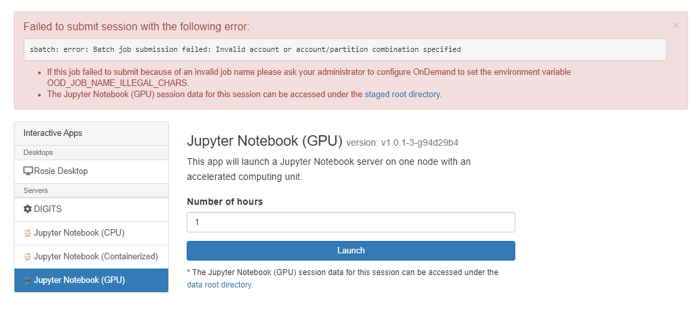

The cluster is only accessible on the campus network. If you are connecting from a building on campus, you are likely already attached to the campus network.

To access Rosie off campus, you must **first connect to the MSOE VPN**. Download a vpn client and log in with your campus credentials (@msoe.edu address).

## Vpn Clients

On **Windows** or **Mac**, you can download the GlobalProtect client from [vpn.msoe.edu](https://vpn.msoe.edu).

On **Linux**, a popular option is to use [openconnect](https://www.infradead.org/openconnect/index.html). Many distributions include openconnect with their default package manager. After you install openconnect, in your terminal execute: `sudo openconnect --protocol=gp vpn.msoe.edu`. 

## Your Cluster Account

The Rosie account management system is synchronized with the MSOE campus Active Directory system. You can access Rosie with your campus username and password.

* Rosie Username: `msoe_username@ad.msoe.edu`
* Rosie Password: `msoe_campus_password`

Where `msoe_username` is the first part of your campus email address. For example, the student John Smith has a MSOE email address `smithj@msoe.edu`, an MSOE username of `smithj`, and a Rosie login of `smithj@ad.msoe.edu`.

## Web Browser Access

Users can use their web browser to interact with Rosie. More information in the [Web Portal](web/dashboard.md) section of guide.

[Rosie Web Portal link](https://dh-ood.hpc.msoe.edu)

**Web Login Screenshot**


### New Account Login

When logging into Rosie for the first time (via the web portal), the system will ask you to create a home folder. Click the steps in sequence to start using the supercomputer.  

> [!Tip]
> Note that when you enter your password in a linux shell, it will not look like you are typing anything, so just enter your MSOE password carefully, and hit enter.

**New user greeting.**


**Web terminal opens in new tab. Type `yes` to continue.**


### SLURM Batch Job Submission Failed



New users may not be able to launch an interactive app on the cluster. If you are running into this error, contact the System Administrator to enroll as an authorized SLURM user able to request supercomputer resources.

## Shell Access

Users can directly connect to the management nodes and open a command line interface.

Connect with **ssh**.

```
    $ ssh "msoeusername@ad.msoe.edu"@dh-mgmt4.hpc.msoe.edu
```

### SSH Terminal Program

**Windows** 

The Windows Operating System does not include ssh by default. There are a number of popular options.

* [PuTTY](https://www.putty.org/) is a classic cross-platofrm solution. Provides users with a ssh terminal login window capable of GUI support. [Getting Started Guide](https://the.earth.li/~sgtatham/putty/0.74/htmldoc/Chapter2.html#gs)
* Windows Subsystem for Linux [Guide](https://docs.microsoft.com/en-us/windows/wsl/install-win10). Brings a linux terminal program to the Windows OS.
* Download and install [GIT](https://git-scm.com/). The included git bash terminal program has a ssh command.

**Mac or Linux**

Your operating system includes this by default, yay! Launch terminal and issue `which ssh` to see the location of the ssh program binary file.


*More info about SSH available on the [OpenSSH homepage](https://openssh.com).*

